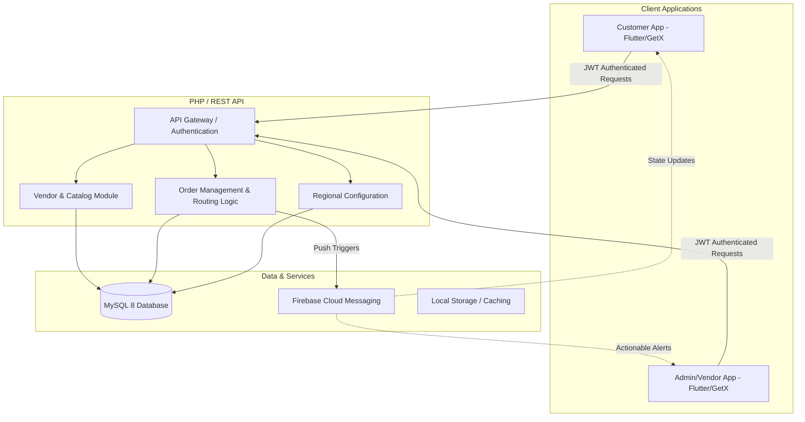

# Order Management & Delivery Ecosystem

Welcome to the **Order Ecosystem**—a comprehensive, multi-platform marketplace and delivery management suite designed for scalability, operational efficiency, and a seamless user experience. 

This organization houses the core infrastructure, applications, and services that power the end-to-end ordering pipeline, from customer browsing to vendor acceptance and final regional delivery.

---

## 🎯 Ecosystem Overview

Our platform is engineered utilizing a domain-driven architecture, strictly separating concerns between the consumer experience, administrative logistics, and data processing. The entire ecosystem operates on real-time data synchronization, robust state management, and strict Role-Based Access Control (RBAC).

### 1. [Backend API Core](./backend)
The backbone of the platform, built with **PHP 8.x** and **MySQL 8.x**. This modular RESTful API serves as the central nervous system for all cross-platform communications.
* **Domain-Driven Structure**: Deeply compartmentalized into logical domains (`user_cart`, `vendor`, `super_admin`, `config`) for maintainability.
* **Complex Routing Logic**: Handles dynamic regional branch routing, ensuring orders are assigned to the correct geographical delivery zones.
* **Robust Security**: Enforces tokenized authentication, rigorous payload sanitization, and strict multi-tier permissions.

### 2. [Customer Application](./order_app)
A performant, cross-platform mobile client built with **Flutter** & **Dart**. Designed to maximize conversion rates through a highly responsive and intuitive user interface.
* **Dynamic Shopping Experience**: Features real-time vendor availability checks, dynamic catalog loading with intelligent caching (`cached_network_image`), and localized state handling via `GetX`.
* **Checkout Pipeline Validation**: Implements strict pre-checkout checks to validate stock, vendor business hours, and regional coverage limitations.
* **Real-time Lifecycle Tracking**: Utilizes Firebase Cloud Messaging (FCM) to provide customers with instant, localized push notifications as their order progresses through the fulfillment pipeline.

### 3. [Administrative & Vendor Dashboard](./order_admin)
A dedicated, mission-critical mobile application built with **Flutter** for system administrators, regional managers, and vendors to control platform operations.
* **Order State Machine Management**: Enforces a strict order progression flow (Pending → Admin Confirmed → Vendor Accepted → Delivering), ensuring data integrity.
* **Dynamic Inventory & Status Control**: Allows vendors to perform full CRUD operations on their catalog (including localized media uploads) and manually override automated business-hour status toggles.
* **Operational Analytics**: Integrates rich data visualizations and real-time operational insights utilizing `fl_chart`.

---

## 🏗️ High-Level Architecture

The platform's architecture emphasizes separation of concerns, data integrity, and high availability.

---

## 🛡️ Security & Reliability Posture

We treat platform security and data integrity as first-class citizens:

* **Obfuscation & Integrity:** Mobile clients are built with robust obfuscation to protect proprietary logic and include root/jailbreak detection mechanisms.
* **Sanitized Inputs:** The backend API utilizes prepared statements and rigorous validation layers to prevent XSS, SQLi, and forced-browsing vulnerabilities.
* **Atomic Transactions:** Critical order pipeline updates are handled via atomic database transactions to prevent race conditions during high-concurrency periods.

---

## 🚀 Getting Started with the Repositories

Each repository within this organization is self-contained with its own detailed documentation. To start exploring or contributing, please refer to the specific `README.md` in the respective repositories:

* 🔗 **[Explore Backend Operations](./backend)**
* 🔗 **[Explore the Customer App](./order_app)**
* 🔗 **[Explore the Admin App](./order_admin)**

---

*This organization strictly follows modern CI/CD practices, comprehensive PR reviews, and enforces clean architecture principles across all codebases.*
